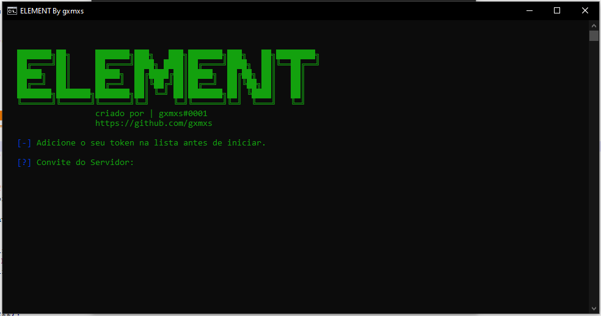

  # ELEMENT: SELFBOT

  ## Recursos:  
  * Feito para divulgações
  
  * 1: Abra o "token.txt" cole seu token la, salve e feche. 
  
  * 2: Abra o "mensagem.txt" cole a mensagem que voce dejesa que seja enviada, salve e feche.
  
  * 3: Abra o ElementDiv.py Cole o codigo de convite do grupo e inicie.
  
  * 4: Logo em seguida a mensagem vai ser enviada no pv de cada um que esteja no servidor.
  # 
Sreenshot
  
  
  ## Requerimento Necessário:
  
  1. [PYTHON](https://www.python.org/downloads/) instale.
  2. Editor de código: VSC (recomendado), Notepad++, Sublime etc.
  
  ## Entre em contato comigo:

﹒[Discord](gxmxs#0001)
﹒[Discord Server](https://discord.gg/pJng7qsN7G)
﹒[Telegram](https://t.me/gxmxss)
